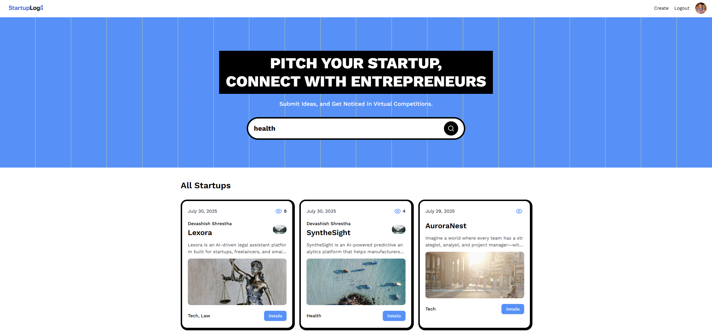

# StartupLog

StartupLog is designed to help startups and entrepreneurs document and share their startup journey. It is a modern web application built with **Next.js**, powered by **Sanity CMS** for content management.

By following this tutorial project from JavaScript Mastery and giving my own personal touch, I got hands-on practice with Next.js App Router and server/client components. I learned how to set up secure authentication, build and use API endpoints, and improve performance with proper error handling.




## Features
- 🔐 Secure authentication with NextAuth
- 📝 Rich content editing with Sanity CMS integration
- 🏷️ Custom tagging and categorization
- 🔍 Advanced search filter capability


### Check out StartupLog [here](https://startuplog.vercel.app/)

## Installation

1. Clone the repository:
```bash
git clone <repository-url>
```

2. Navigate to the project directory:
```
cd startup-log
```

3. Install dependencies:
```
npm install
```

4. Create a .env.local file in the root directory with following variables:
```
AUTH_SECRET=your_auth
AUTH_GITHUB_ID=your_github_id
AUTH_GITHUB_SECRET=your_github_secret

NEXT_PUBLIC_SANITY_PROJECT_ID=your_sanity_project_id
NEXT_PUBLIC_SANITY_DATASET=production
NEXT_PUBLIC_SANITY_API_VERSION=your_api_version

SANITY_WRITE_TOKEN=your_sanity_write_token
SANITY_READ_TOKEN=your-sanity-read-token

(In .env.sentry-build-plugin include --> SENTRY_AUTH_TOKEN=your_sentry_auth_token)
```

5. Run the development server:
```
npm run dev
```

